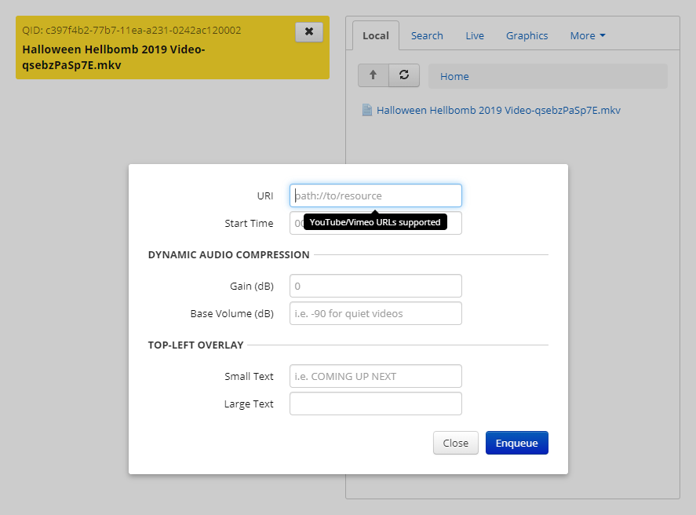

# TheaterWithFriends

This project runs a website on YOUR server that lets you play videos
stored ON the server and YouTube, Vimeo,, etc. videos, synced to everyone else.

It USED to be able to display motion graphics on-demand with your own text, 
but this function is now broken for the time being.

#### ⚠ BIG Warnings ⚠

This project is almost ten years old and I have gotten it to run BUT not perfectly.

The server is NOT secure AT ALL anymore unless you change the source files.

Please bear with it. 

\-Thanks, the management

## Requirements

**BIG REQUIREMENT:** You own a Linux server and know how to configure one.,

Technical knowledge required: Pasting commands

## Setup and Usage

These steps are for Ubuntu in the command line.

1. Download the project. Put it somewhere and `cd` to it.
1. [Install Docker](https://docs.docker.com/install/).
1. `sudo apt-get install -y docker-compose`
1. `docker-compose build && docker-compose up -d` (remove the -d if you want to see the log when it starts up)
1. Upload videos to the "content" folder (pretty much every common video format works). 
You can upload files when the software is running.

Now, go to `http://YOUR_IP/manage/` with username `admin` and password `admin`. You can:

* Queue up videos that you uploaded
* Queue up YouTube/etc. URLs from More -> Enqueue
* The graphics tab DOES NOT WORK anymore.
* The live tab DOES NOT WORK anymore.

To video your video, go to `http://YOUR_IP:8080/` (don't forget the :8080)

### Caveats

* Once you start a video, it will take a few seconds before it will actually start playing. 
Verify on `http://YOUR_IP:8080/stats.xml` that there is a "theater" stream.
* Try to always have a video queued, but your friends can always refresh the page. 